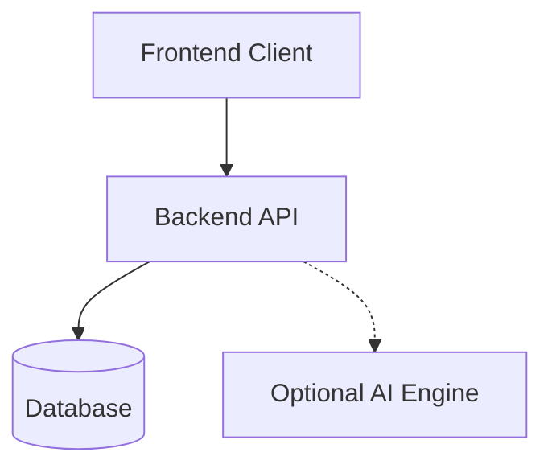
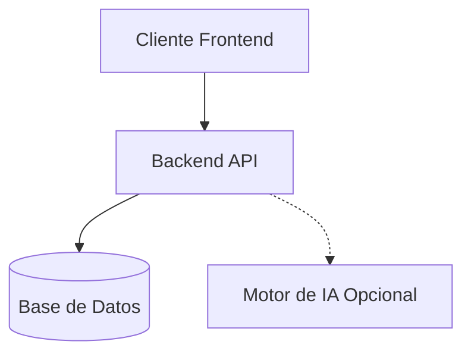

# AI Governance Assessment Platform / Plataforma de Evaluación de Gobernanza de IA

[English](#english) | [Español](#español)

---

<a id="english"></a>

## English

### Overview

The AI Governance Assessment Platform is a comprehensive tool designed to help organizations evaluate, manage, and monitor the governance of their Artificial Intelligence systems. It solves the critical problem of ensuring that AI deployments are ethical, secure, compliant, and aligned with organizational strategies by providing a structured assessment methodology.

### Problem Statement

As AI adoption accelerates, organizations face significant challenges in managing associated risks, such as bias, security vulnerabilities, and compliance failures. AI governance assessments are important because they provide a systematic way to identify these risks, ensure accountability, and build trust among stakeholders. Without proper governance, AI systems can lead to reputational damage, financial loss, and regulatory penalties.

### Key Features

- **Governance assessment:** Evaluate AI systems across multiple standardized domains.
- **Risk identification:** Proactively detect potential vulnerabilities and ethical concerns.
- **Compliance readiness:** Prepare for upcoming regulations and audits.
- **Report generation:** Automatically generate actionable risk and governance reports.

### Governance Framework Alignment

This platform is aligned with and supports the following major standards and frameworks:

- **NIST AI Risk Management Framework (AI RMF)**
- **ISO/IEC 42001 (Artificial Intelligence Management System)**
- **Responsible AI principles** (Fairness, Transparency, Accountability, Privacy, etc.)
- **EU AI Act readiness**

### Platform Architecture

The application is built on a modern, decoupled architecture:

- **Frontend:** User interface for interacting with assessments and reports.
- **Backend API:** Orchestrates business logic, user management, and assessment processing.
- **Database:** Stores user profiles, assessment data, and system configurations.
- **Optional AI Engine:** Provides intelligent scoring, insights, and automated report generation via an LLM.



### Quick Start

To get the platform running locally, use the following commands:

```bash
git clone https://github.com/davidortizac/ai-governance-assessment-platform.git
cd ai-governance-assessment-platform
docker-compose up -d
```

### Deployment Options

The platform is designed to be highly flexible and can be deployed in the following environments:

- **Local deployment:** Using Docker Compose for development and testing.
- **On-premise deployment:** Deploying on internal organizational servers for maximum data privacy.
- **Cloud deployment:** Hosting on platforms like AWS, Azure, or GCP for scalability and high availability.

### Documentation

For more detailed information, please refer to the following guides:

- [Deployment Guide (DEPLOY.md)](DEPLOY.md)
- [User Manual (USER_MANUAL.md)](USER_MANUAL.md)
- Additional architecture and deeper guides in the `docs/` directory.

### License

This project is licensed under the [MIT License](LICENSE).

---

<a id="español"></a>

## Español

### Descripción General

La Plataforma de Evaluación de Gobernanza de IA es una herramienta integral diseñada para ayudar a las organizaciones a evaluar, gestionar y monitorear la gobernanza de sus sistemas de Inteligencia Artificial. Resuelve el problema crítico de garantizar que las implementaciones de IA sean éticas, seguras, cumplan con las normativas y estén alineadas con las estrategias organizacionales, proporcionando una metodología de evaluación estructurada.

### Declaración del Problema

A medida que la adopción de la IA se acelera, las organizaciones enfrentan desafíos importantes en la gestión de los riesgos asociados, como sesgos, vulnerabilidades de seguridad y fallos de cumplimiento. Las evaluaciones de gobernanza de IA son importantes porque proporcionan una manera sistemática de identificar estos riesgos, garantizar la rendición de cuentas y generar confianza. Sin una gobernanza adecuada, la IA puede provocar daños a la reputación, pérdidas y sanciones.

### Características Principales

- **Evaluación de Gobernanza (Governance assessment):** Evalúa los sistemas de IA en dominios estandarizados.
- **Identificación de Riesgos (Risk identification):** Detecta proactivamente vulnerabilidades y preocupaciones éticas.
- **Preparación para el Cumplimiento (Compliance readiness):** Prepárate para las regulaciones y auditorías.
- **Generación de Informes (Report generation):** Genera automáticamente informes accionables.

### Alineación con Marcos de Gobernanza

Esta plataforma respalda los siguientes estándares y marcos:

- **NIST AI Risk Management Framework (RMF)**
- **ISO/IEC 42001 (Sistema de Gestión de Inteligencia Artificial)**
- **Principios de IA Responsable**
- **Preparación para la Ley de IA de la UE (EU AI Act)**

### Arquitectura de la Plataforma

La aplicación consta de los siguientes componentes:

- **Frontend:** Interfaz web.
- **Backend API:** Orquesta la lógica del negocio.
- **Database (Base de Datos):** Almacena perfiles e información de evaluación.
- **Motor de IA Opcional (Optional AI Engine):** Genera puntuación inteligente e informes usando un LLM.



### Inicio Rápido

Comandos:

```bash
git clone https://github.com/davidortizac/ai-governance-assessment-platform.git
cd ai-governance-assessment-platform
docker-compose up -d
```

### Opciones de Despliegue

- **Despliegue Local (Local deployment)**
- **Despliegue On-premise (On-premise deployment)**
- **Despliegue en la Nube (Cloud deployment)**

### Documentación

- [Guía de Despliegue (DEPLOY.md)](DEPLOY.md)
- [Manual de Usuario (USER_MANUAL.md)](USER_MANUAL.md)
- Más información en la carpeta `docs/`.

### Licencia

Licencia MIT (MIT License).
