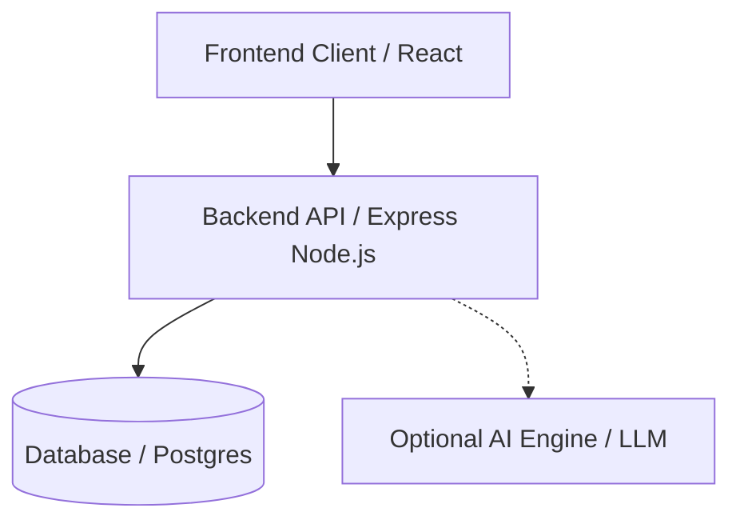
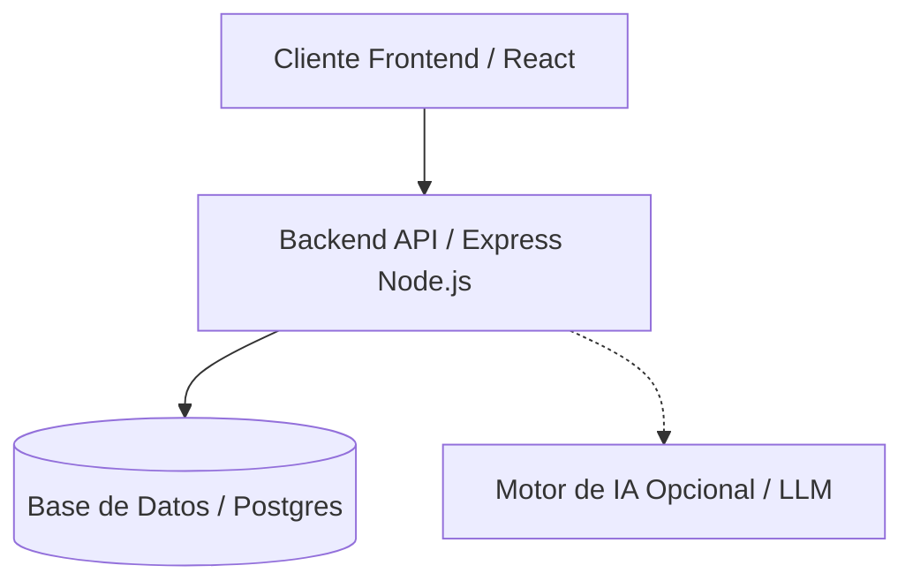

# Reference Architecture / Arquitectura de Referencia

[English](#english) | [Español](#español)

---

## English

### Platform Architecture

The application is built on a modern, decoupled architecture designed for high scalability and secure governance assessments:

- **Frontend:** A user interface for interacting with assessments and reports securely.
- **Backend API:** Orchestrates the core business logic, user management, and governance workflows.
- **Database:** Stores user profiles, assessment data, system configurations, and metric results.
- **Optional AI Engine:** Provides intelligent scoring, insights, and automated report generation via an LLM to evaluate risks dynamically.

---

## Español

### Arquitectura de la Plataforma

La aplicación está construida sobre una arquitectura moderna y desacoplada, diseñada para alta escalabilidad y evaluaciones de gobernanza seguras:

- **Frontend:** Interfaz de usuario para interactuar de forma segura con las evaluaciones.
- **Backend API:** Orquesta la lógica del negocio principal y el flujo de trabajo de la gobernanza.
- **Database (Base de Datos):** Almacena perfiles de usuario, datos de evaluación y métricas.
- **Motor de IA Opcional (Optional AI Engine):** Proporciona puntuación de riesgos inteligente a través de un LLM.

