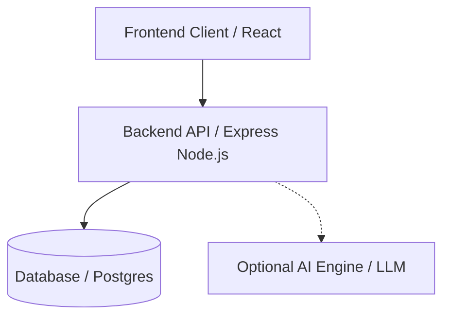

> **Note:** This is a personal development for Gamma Ingenieros.

# Reference Architecture

### Platform Architecture

The application is built on a modern, decoupled architecture designed for high scalability and secure governance assessments:

- **Frontend:** A user interface for interacting with assessments and reports securely.
- **Backend API:** Orchestrates the core business logic, user management, and governance workflows.
- **Database:** Stores user profiles, assessment data, system configurations, and metric results.
- **Optional AI Engine:** Provides intelligent scoring, insights, and automated report generation via an LLM to evaluate risks dynamically.

