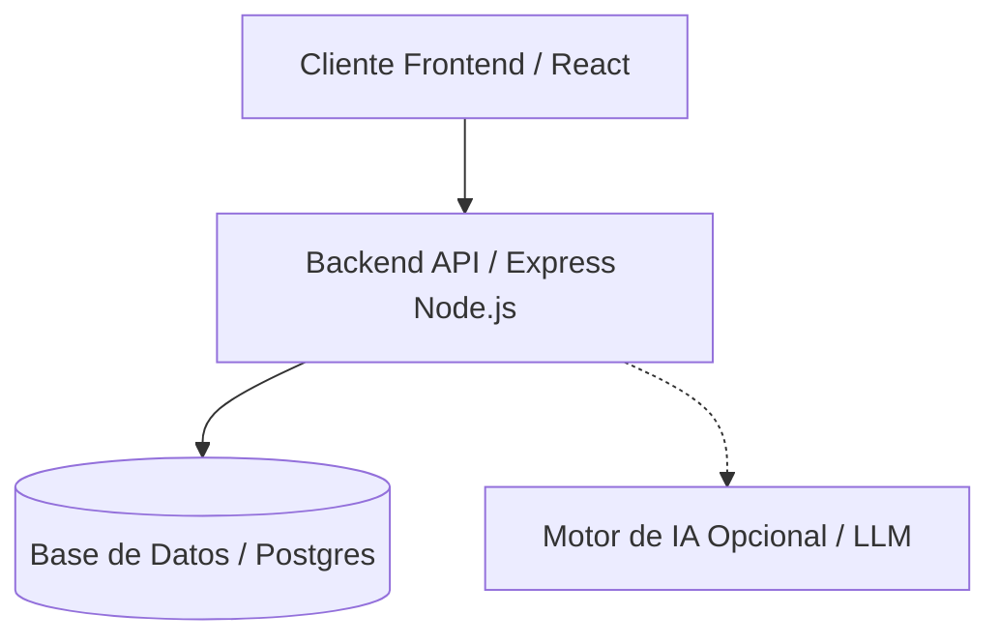

> **Nota:** Este es un desarrollo personal para Gamma Ingenieros.

# Arquitectura de Referencia

### Arquitectura de la Plataforma

La aplicación está construida sobre una arquitectura moderna y desacoplada, diseñada para alta escalabilidad y evaluaciones de gobernanza seguras:

- **Frontend:** Interfaz de usuario para interactuar de forma segura con las evaluaciones.
- **Backend API:** Orquesta la lógica del negocio principal y el flujo de trabajo de la gobernanza.
- **Database (Base de Datos):** Almacena perfiles de usuario, datos de evaluación y métricas.
- **Motor de IA Opcional (Optional AI Engine):** Proporciona puntuación de riesgos inteligente a través de un LLM.

